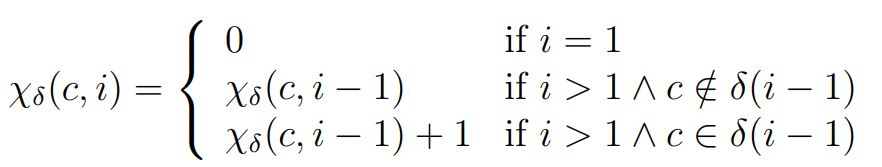

## Background

最近有机会用Latex写了一篇近似于论文格式的报告，算是熟悉了一些基础的语法。我想我遇到的问题都是比较实际的，就想记录下来，于己于人都是好的。

首先有一些概要：因为我看了网上Latex的安装教程有点麻烦（自己太菜），就找了一个在线的网站:[https://www.overleaf.com/](https://www.overleaf.com/)。

然后Latex有包（package）的概念，有些功能需要你在开头导入指定的包，这也会在之后详细解释。

## Structure

一篇常见的论文的格式如下所示：

```latex
\documentclass{article}
\usepackage[utf8]{inputenc}

\title{Title}
\author{Author}
\date{Date}

\usepackage{natbib}
\usepackage{graphicx}
\usepackage{indentfirst}

\begin{document}

\maketitle

Your Abstract

\section{Introduction}

\section{Conclusion}

\bibliographystyle{plain}
\bibliography{references}
\end{document}
```

其中`\maketitle`下面写摘要，`\section`是一级标题，`\subsection`是二级标题，`\subsubsection`是三级标题。比较特殊的是引用，也就是所有参考文献的详细信息全部存放在另外一个`references.bib`文件中。然后你在谷歌学术或者dblp中会发现有单独的bib文献引用格式，将它们直接复制到`references.bib`文件中就可以在文末看到Latex自动帮你生成的参考文献了。然后在正文中使用`\cite{}`语法来引用论文。

## Detail

1. 链接：需要导入`url`包，正文中使用`\url{}`。

   写法：
   ```
   \documentclass{article}
   \usepackage[utf8]{inputenc}
   \usepackage{url}
   ...
   \url{https://github.com/Callmejp/CCSL2Maude}
   ...
   ```
2. 空行：在段落后面添加`\\`。
3. 公式：
   * 正文中的公式直接使用`$eqution$`包裹。
   * 需要自成段落的“大公式”最好使用Latex语法包裹，比如下面这样由`\begin{equation*}`和`\end{equation*}`包裹。其中有一些`非常有用的细节`：加星号*是防止生成后缀的公式标号；`ll`是左对齐；另外下面可以生成大括号，具体效果看图。
     ```
     \begin{equation*}
     \chi_{\delta}(c, i) = \left\{
     \begin{array}{ll}
     0 & \text{if}\ i = 1\\
     \chi_{\delta}(c, i-1) & \text{if}\ i > 1 \land c \notin \delta(i-1)\\
     \chi_{\delta}(c, i-1) + 1 & \text{if}\ i > 1 \land c \in \delta(i-1)
     \end{array} \right.
     \end{equation*}
     ```
     效果如下:

     

     * 有些公式字符还需要导入`\usepackage{amsmath}`包。
4. `\textsl{}`是倾斜，`\textbf{}`是加粗。
5. 图片：其中`centering`表示居中；`scale`控制图片的缩放大小；`caption`里是图片底下的说明文字。最重要的是`[t!]`。因为想必你也发现了，一般论文的图片总是在一页的最开始，我们的`t`就代表着top，Latex会自动帮我们将图片悬浮到页面顶端。当然，下面代码所示的图片就存放在与论文一个目录下。
   ```
   \begin{figure}[t!]
   \centering
   \includegraphics[scale=0.8]{union.JPG} 
   \caption{Union relation defined by Min et al.}
   \label{fig:Union}
   \end{figure}
   ```
6. 代码：需要用到额外的包及设置自己喜欢的样式，这边直接拷贝了官方教程的样例。
   ```
   \usepackage{listings}
   \usepackage{xcolor}

   \definecolor{codegreen}{rgb}{0,0.6,0}
   \definecolor{codegray}{rgb}{0.5,0.5,0.5}
   \definecolor{codepurple}{rgb}{0.58,0,0.82}
   \definecolor{backcolour}{rgb}{0.95,0.95,0.92}
 
   \lstdefinestyle{mystyle}{
        backgroundcolor=\color{backcolour},   
        commentstyle=\color{codegreen},
        keywordstyle=\color{magenta},
        numberstyle=\tiny\color{codegray},
        stringstyle=\color{codepurple},
        basicstyle=\ttfamily\footnotesize,
        breakatwhitespace=false,         
        breaklines=true,                 
        captionpos=b,                    
        keepspaces=true,                 
        numbers=left,                    
        numbersep=5pt,                  
        showspaces=false,                
        showstringspaces=false,
        showtabs=false,                  
        tabsize=2
    }
 
   \lstset{style=mystyle}
   ```
   对，就是有这么多参数可以自行调节。然后在正文中：
   ```
   \begin{lstlisting}
   Your Code Here.
   \end{lstlisting}
   ```

## Format

1. 一级目录下段落自动左对齐的问题。需要导入`\usepackage{indentfirst}`。
2. 打印出来所占A4纸页面过小及字体过小问题。
   
   控制所占比例，如下所示就是70%。
   ```
   \usepackage{geometry}
   \geometry{a4paper,scale=0.7}
   ```

   字体过小的话可以直接在第一行加`[12pt]`。
   ```
   \documentclass[12pt]{article}
   ...
   ```

## Conclusion

以上就是我在使用Latex过程中遇到的一些问题以及解决办法。当然只是非常小的一部分，但相比文档的繁复，肯定是超级实用啦！